== Работа в IAR Embedded Workbench
Сперва был создан проект C++ в программе *IAR Embedded Workbench* (рисунок 1)

.Создание проекта в программе
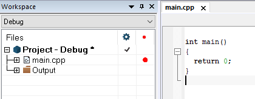

После создания проекта нужно было подключить файл _cstarup.cpp_.
Данный файл был скачан из проекта преподавателя. Чтобы его подключить,
используем _Add - Add Files..._(рисунок 2)

.Добавление файла cstartup.cpp
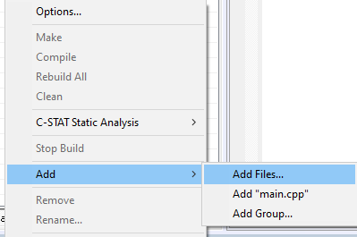

Теперь нам нужно настроить сам проект, его структуру. Для этого
аналогично, через меню _Add - Add Group..._ добавим
папки _AHardware/Registers/STM32F411, Common, Application_.
Готовая структура преставлена на рисунке 3.

.Структура проекта
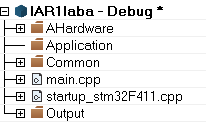

Затем, нужно добавить все нужные заголовочные файлы. Для
этого будем скопируем их в корневую папку проекта (рисунок 4).

.Перенос заголовочных файлов
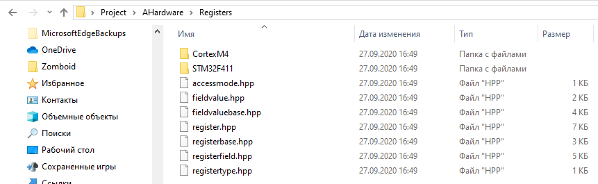

После этого мы должны добавить данные файлы в программе *IAR Embedded
Workbench*. Используем _Add-Add Files..._ и окончательно структурируем
наш проект (рисунок 5).

.Полученный результат
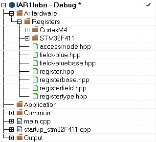

После выполнения всех действий запишем код в _main.cpp_ (рисунок 6).

.Код в программе
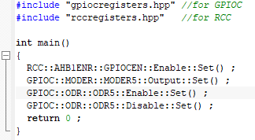

Теперь нажмём на проект ПКМ и выберем _Rebuild All_. У нас появилась
следующая ошибка (рисунок 7).

.Возникшая ошибка
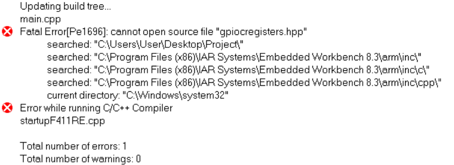

Данная ошибка означает, что компилятор не может найти путь до
заголовочного файла "_gpiocregisters.hpp_",
поэтому нужно указать директорию в _Options -> C/C++ Compiler ->
Preprocessor_ и выбрать нужную нам директорию (рисунок 8, 9).

.Выбор директории
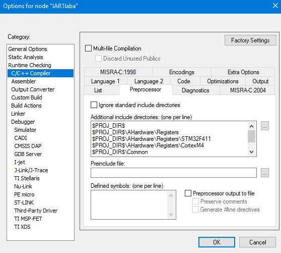

.Выбор директории
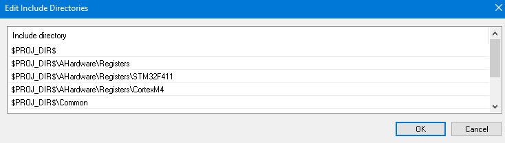

После выполнения данного действия выполним повторную компиляцию проекта
и заметим, что ошибка ушла, но теперь появилась новая (рисунок 10).

.Возникшая ошибка
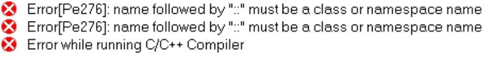

Данная ошибка связана с тем, что компилятор не может найти объявление нужного класса.
Нужно убедиться, что мы включили соответствующий заголовок в единицу перевода,
на которую жалуется компилятор. Для решения этой проблемы мы немного видоизменили код (рисунок 11).

.Изменения в коде
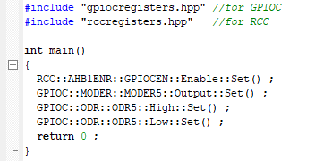

После выполнения данного действия никаких проблем с компиляцией не возникло.
Поэтому запустим программу через отладчик "_Simulator_" (рисунок 12).

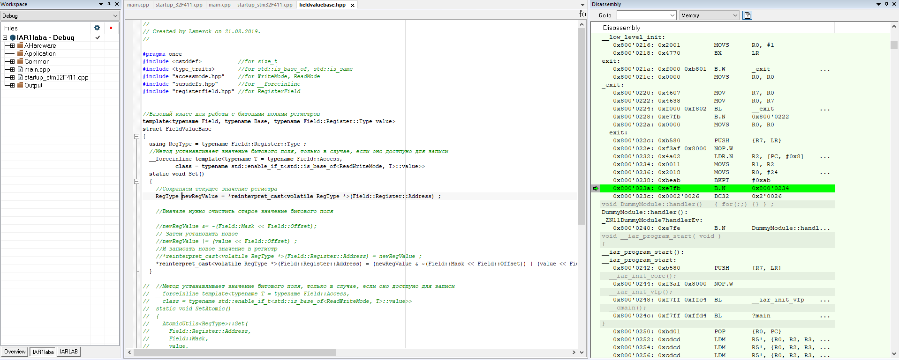

=== Настройка проекта

Для того, чтобы запустить программу на микроконтроллере нам нужно сделать
первичные настройки проекта.  Нам нужно изменить
_Device_ на микроконтроллер *STM32F411 RE* в меню _General Options_ (рисунок 13)

.Настройка проекта
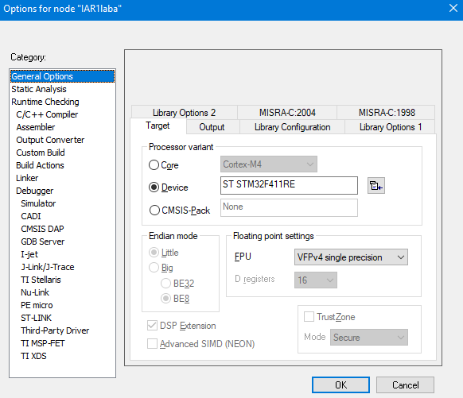

В меню _Options - Debugger_ выбираем внутрисхемный отладчик _ST-Link_ и интерфейс SWD (рисунок 14).

.Настройка проекта
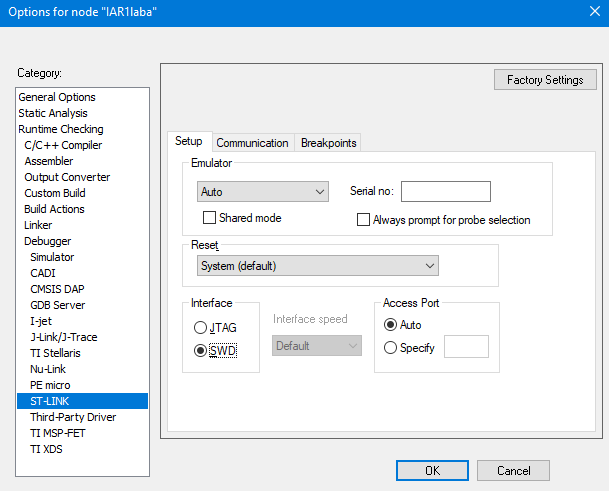

Также произведем настройку _Stack/Heap_. Для этого в меню _Linker_ снимем галочку с пункта
_Override default_ и нажмём на _Edit..._ (рисунок 15)

.Настройка STACK/HEAP
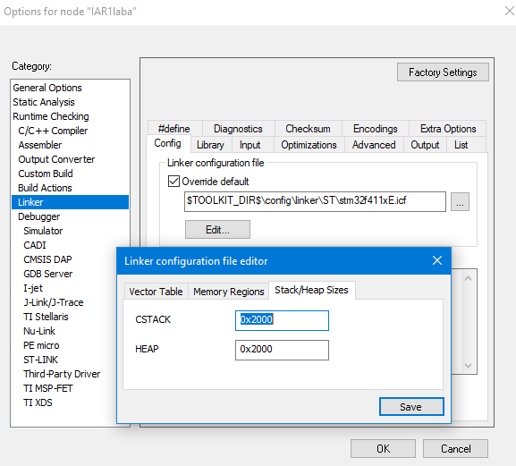

Для примера изменим данное значение с 0x2000 на 0x1000.

_Данное действие можно также выполнить в файле stm32f411xE.icf,
поменяв значение символа __ICFEDIT_size_cstack_.

=== Загрузка на плату

После выполнения всех этих действий, мы можем загружать программу в плату. Нажав сочетание клавиш _Ctrl+D_ запустим режим отладки.
После компиляции никаких ошибок не возникло, поэтому проект без проблем загрузился на плату.
Выполняем пошаговую отладку и никаких видимых изменений на плате, помимо мигания светодиода на отладчике на заметили.

.Плата в рабочем состоянии
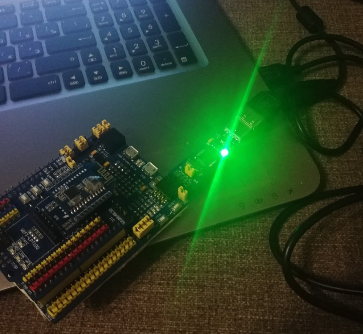

=== Анализатор стека

Следующим заданием будет запуск анализатора стека. Чтобы его включить, нужно перейти в _Options - Linker - Advanced..._ и
поставить галочку напротив _Enable stack usage analysis_ (рисунок 16).

.Запуск анализатора стека
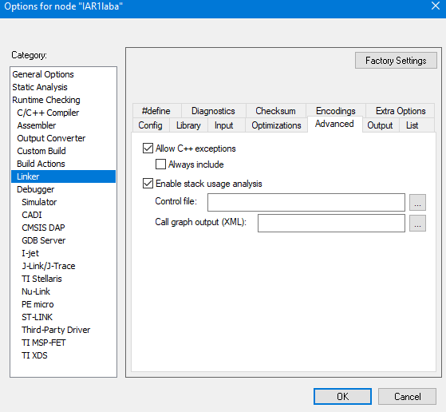

После повторного запуска программы с включенной опцией, откроем файл с расширением _.map_.
Отметим, что в данном случае анализ стека показывает, что размер стека при максимальной цепочке вложенности может быть 16 байт

.Открытие _.map_ файла
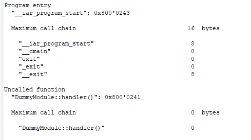

Следующим заданием было установить размеры стека и "кучи" в ноль. И объяснить почему так нельзя делать.

.Установка Stack/Heap в ноль
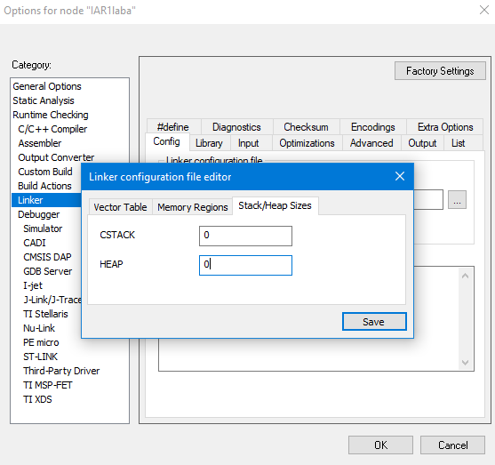

Мы не можем устанавливать размеры Stack/Heap в ноль, потому что в Stack хранятся все локальные переменные и адреса возвратов функций.
А Heap это выделенная память под обработку различных функций, которые записали в микроконтроллер, то есть у нас не
будет памяти под динамическое распределение памяти приложения.

=== Ответы на вопросы:

1) Дайте определение понятию “Интегрированной среде разработки”

*Ответ:*

_Интегрированная среда разработки - комплекс программных средств, используемый программистами для разработки программного обеспечения._

2) Что такое компилятор и чем он отличается от транслятора?

*Ответ:*

_**Транслятор** - программа, переводящая исходный код (программу, написанную на одном из высокоуровневых языков программирования) в объектный код, используемый процессором компьютера, или в промежуточный код для последующей интерпретации. Помимо осуществления перевода, трансляторы могут выявлять в исходном коде ошибки, оптимизировать исходный код, добавлять в исходный код отладочные процедуры, формировать словари идентификаторов и другое._

_**Компилятор** – это вариант реализации транслятора, который создаётся для перевода программы, написанной на высокоуровневом языке программирования в машинный код, который в последствие будет исполняться процессором
Компилятор является видом транслятора и предназначен только для
перевода кода. Осуществлять выявление ошибок в коде, оптимизац
ию, добавлять в исходный код отладочные процедуры и др он не способен._

3) Что такое компоновщик и какие функции он выполняет?

*Ответ:*

_**Компоновщик** предназначен для связывания между собой объектных файлов, порождаемых компилятором, а также файлов библиотек, входящих в состав системы программирования.
Объектный файл (или набор объектных файлов) не может быть исполнен до тех пор, пока все модули и секции не будут в нем увязаны между собой. Это и делает редактор связей (компоновщик)._

*Таким образом компоновщик выполняет две функции:*

- комбинирует (компонует, редактирует) различные объектные файлы;
- устанавливает связи между объявлением функции или переменной с ее определением._

4) Почему важен процесс проектирования ПО какие задачи входят в этот процесс?

*Ответ:* _Перед тем, как писать код, необходимо четко понимать, с какой целью он пишется. Обозначить структуру , задачи и определить пути их решения. Без подготовки процесс разработки теряет в эффективности.
Проектирование включает в себя следующие задачи:_

- выбор метода и стратегии решения;

- выбор представления внутренних данных;

- разработка основного алгоритма;

- документирование ПО;

- тестирование и подбор тестов;

- выбор представления входных данных.

5) Дорисуйте процесс разработки ПО [IAR Workbench] с учетом итеративности связей в этом процессе

*Ответ:*

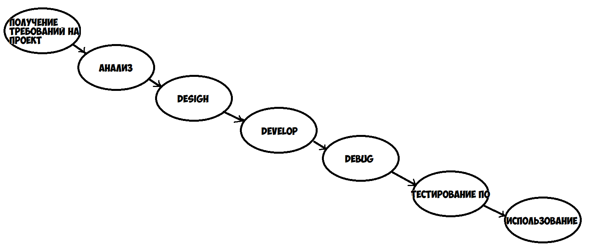

6) Зачем нужная отладка и в каких случаях она применяется? Для чего применяются точки остановки?

_*Ответ:* Отладка - это этап разработки программы, на котором обнаруживают, локализуют и устраняют ошибки.
Чтобы понять, где возникла ошибка, приходится: узнавать текущие значения переменных; выяснять, по какому пути выполнялась программа.
Именно для этого и используются точки остановки. Поставив такую в месте, где нужно узнать что-то о переменной, можно получить подробную информацию
о объекте._

7) Какие еще важные IAR workbench можно добавить в таблицу [Характеристики IAR]

*Ответ:*

- Возможность запуска проекта в режиме симуляции выбранного микроконтроллера;
- Удобно использовать несколько конфигураций. В конфигурации Debug
можно выбрать симулятор программатора, а в Release – конкретный
программатор (к примеру, J-Link). Что позволит сначала отлаживать в
симуляторе, не теряя время на прошивку микроконтроллера, а потом уже
прошивать под конфигурацией Release;
- Совместимость с большим количеством микроконтроллеров;
- Мониторинг состояние процессора;
- Удобная отладка с возможностью просматривать состояние переменных;
- Большая база пользователей и документации.

